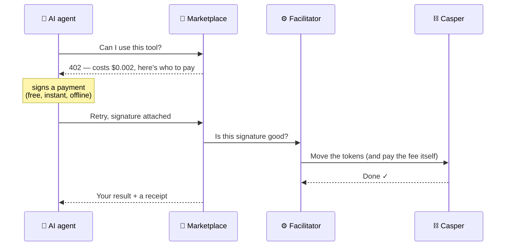
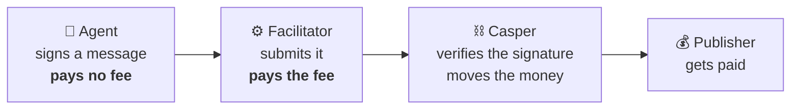

# AgentifyOS

**The marketplace where AI agents shop for tools.** Developers publish a paid tool in 60 seconds; autonomous agents discover it, pay per call with **x402 on Casper** — no API keys, no accounts — and walk away with an on-chain receipt. Every settlement updates the listing's reputation, so **the payment is the review**.

Built for the **Casper Agentic Buildathon 2026 — Final Round**.

> ### ✅ Live on Casper testnet
> An autonomous agent paid for **four tools in one task, holding zero CSPR** — four
> real `transfer_with_authorization` settlements:
> [`907f08f6`](https://testnet.cspr.live/deploy/907f08f6a4ccd569fb4bde9babf63bb80a273c017772dd3bded39c29d047a925) ·
> [`86d61db6`](https://testnet.cspr.live/deploy/86d61db62442d867adde20254cedab64525b65d578139fbe171ade11ee257b85) ·
> [`0db4cbf1`](https://testnet.cspr.live/deploy/0db4cbf14be6d6e2d30dc1035447ec466de3026e2c0f0eeb2ee642dbc55a1420) ·
> [`3d438f24`](https://testnet.cspr.live/deploy/3d438f2451054c4bb482ff363a4612b0e1974c7777440638ae9d5d45b2c0acf2)
>
> Evidence, balance deltas and gas measurements: **[docs/PROOF.md](docs/PROOF.md)**

> `agentifyos.xyz` · settles the x402 `exact` scheme on `casper:casper-test` (WCSPR CEP-18, EIP-712-signed `transfer_with_authorization`).

---

# Part 1 — In plain English

**No crypto knowledge needed.** Skip to [Part 2](#part-2--for-developers) for the technical version.

## The problem

AI agents are starting to do real work on their own. But **they can't buy anything.**

Say an agent is mid-task and realises it needs something it doesn't have — a webpage read, a document verified, a price checked. A service exists that does exactly that. The agent still can't use it, because every payment system on earth assumes a human is behind it:

| The obstacle | Why it stops a machine |
|---|---|
| **API keys** | A human must sign up, add a card, generate a key and wire it in — *before* the agent ever runs |
| **Credit cards** | Fees make a $0.002 purchase absurd, and there's no cardholder to be defrauded |
| **Subscriptions** | An agent might call a tool once ever, or 50,000 times in an hour |

The real cost is subtle: **an agent's tools are fixed in advance by whatever a human set up.** It can never find and use something new on its own.

## The solution

The web has always had a "you must pay for this" response code — **HTTP 402** — reserved in the standard since the 1990s and never used, because no payment system could handle fractions of a cent.

Now one can. So the exchange becomes:



The whole thing takes a few seconds. **No sign-up, no API key, no human.**

## The one clever bit

The agent **never touches the blockchain and holds no cryptocurrency for fees.** It only signs a message — free and instant. A separate service, the *facilitator*, submits that signature and pays the transaction fee.

That's what makes this practical. Otherwise every agent would need its own topped-up crypto wallet just to spend money — precisely the friction we're removing.



## Why a marketplace

Casper's payment rails went live in June 2026 — but there was almost nothing to buy on them. Before one company added 20,000 tools in June, the entire x402 network had roughly **2,000 payable endpoints worldwide**.

> **The plumbing got standardised before the shops opened.** Forty of the largest payment and cloud companies — Visa, Mastercard, Stripe, Google, AWS — ratified this standard on 14 July 2026, for a network with barely anything for sale.
>
> That gap is the opportunity. AgentifyOS is the shop.

## And the trust problem

Star ratings can be bought. Ours can't, because **there are none.** A tool's reputation is computed purely from payments that actually settled on a public blockchain — real calls, real distinct buyers, real success rates.

You cannot fake a reputation without genuinely paying for it. **The payment is the review.**

## See it yourself

- **[docs/START-HERE.md](docs/START-HERE.md)** — the full explainer, still assuming zero knowledge
- **`/explain`** in the running app — the same ideas as interactive diagrams
- **`/agent`** — watch an agent do it live, then click the blockchain receipt

---

# Part 2 — For developers

## What's here

| Surface | For | Route |
|---|---|---|
| Marketplace web | humans | `/` · `/tools` · `/tools/[slug]` · `/publish` · `/dashboard` · `/explain` |
| **Agent demo** | everyone | `/agent` — discovers, pays, completes a task, live |
| **CLI** | terminal | `pnpm agentify call <slug>` — a real x402 client |
| **MCP server** | Claude / Cursor | `pnpm mcp` — lets an AI assistant buy tools |
| Paid endpoint | agents | `/api/t/[slug]` — real HTTP 402 → pay → result + receipt |
| Discovery | agents | `/api/discovery/*` · `/api/mcp` · `/llms.txt` |

The CLI and MCP server are **ordinary x402 clients** — their own keys, paying over the same public HTTP endpoint as everyone else. No privileged internal path.

## The core loop

1. Agent calls a tool → **HTTP 402** + `PaymentRequirements` (scheme `exact`, network `casper:casper-test`, WCSPR asset).
2. Agent signs an **EIP-712** authorization with its own Ed25519 key, retries with `PAYMENT-SIGNATURE`.
3. The facilitator verifies (signature, amount, time window, payee) and settles on Casper — **paying gas itself**.
4. Payment clears → the tool runs → the agent gets the **result + a receipt** (`deployHash` → testnet.cspr.live).
5. The settlement updates the listing's ledger-derived reputation.

## Run it

```bash
pnpm install
pnpm dev                     # http://localhost:8402
```

With `MODE=real` (the default), every payment is a real Casper testnet settlement. It needs two funded keys — the 10-minute setup is **[docs/TESTNET.md](docs/TESTNET.md)**:

```bash
cd apps/web
pnpm casper:keygen                              # facilitator / treasury / agent keys
#   → fund facilitator + treasury from the testnet faucet
pnpm casper:wrap --cspr 100                     # CSPR → WCSPR
pnpm casper:transfer --to agent --amount 10000000000
pnpm agentify call cspr-market-data             # a real paid call
pnpm casper:balance                             # read balances from the chain
```

We **self-host the facilitator** (our key + the public testnet RPC) — no API key, no quota.

Prove the cryptography without spending anything:

```bash
pnpm selftest                # payment-loop invariants incl. replay guard
pnpm casper:signtest         # real EIP-712 sign/verify with real Casper keys, offline
pnpm test:e2e                # Playwright smoke suite
```

## Documentation

| Doc | What |
|---|---|
| [START-HERE](docs/START-HERE.md) | the whole thing from zero knowledge |
| [HOW-IT-WORKS](docs/HOW-IT-WORKS.md) | architecture and the payment flow |
| [PROOF](docs/PROOF.md) | on-chain evidence — deploy hashes, balances, gas |
| [TESTNET](docs/TESTNET.md) | zero to a real settlement |
| [CLI-AND-MCP](docs/CLI-AND-MCP.md) | using it from a terminal or from Claude |
| [ADDRESSES](docs/ADDRESSES.md) | keys, contracts, entry points, ports |

## Stack

Next.js 16 · React 19 · Tailwind v4 · Zustand · Geist · React Flow · TypeScript · Prisma/Postgres (optional) · Docker · Playwright. Payments signed with `@casper-ecosystem/casper-eip-712` and settled via `casper-js-sdk` against the WCSPR CEP-18 contract.

## Architecture

```
apps/web
  src/app            landing · catalog · detail · publish · dashboard · agent · explain · roadmap
    api/t/[slug]     the real HTTP 402 paid endpoint
    api/agent/run    server-side agent loop (discover → pay → complete)
    api/discovery/*  machine-readable catalog + search
    api/mcp          HTTP MCP-style surface
    llms.txt         agent discovery manifest
  src/lib/x402
    casper           REAL engine — EIP-712 signing, verification, on-chain settlement,
                     CSPR→WCSPR wrapping, CEP-18 transfer, balance reads
    client           the x402 HTTP client (402 → sign → retry) used by CLI + MCP
    loop / real-loop the paid-call engine and task planner
  scripts
    cli.ts           `pnpm agentify`
    mcp-server.ts    `pnpm mcp` (stdio)
    casper/*         keygen · balance · wrap · transfer · pay · sign-test
```

## Design

Refined-light, editorial, data-as-typography — inspired by [designsystems.surf](https://designsystems.surf), re-typeset in Geist and retimed to Emil Kowalski's motion (sub-300ms, custom easing, `scale(0.97)` press). Geist Mono carries every price, hash, and stat.

## Judging artifacts

- **On-chain proof** — [docs/PROOF.md](docs/PROOF.md)
- **Live demo** — `/agent`, producing settlements you can open on the explorer
- **Interactive explainer** — `/explain`
- **Launch plan** — `/roadmap`

---

_Casper built the rails. We built the market._
